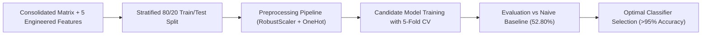

<div align="center">


## UNIVERSIDAD DE CARABOBO
### FACULTAD EXPERIMENTAL DE CIENCIAS Y TECNOLOGÍA (FACYT)
#### DEPARTAMENTO DE COMPUTACIÓN

**Course:** Machine Learning (*Aprendizaje Automático - Electiva 2026*)  
**Professor:** Álvaro Espinoza  

---

# Pokémon Battle Winner Predictor
### Assignment 1: Exploratory Data Analysis (EDA) & Feature Engineering

[](https://www.python.org/)
[](https://jupyter.org/)
[](LICENSE)
[](#)

</div>

---

## 📖 1. Project Overview & Problem Formulation

In competitive turn-based games such as Pokémon, match outcomes are determined by a complex interplay of deterministic physical stats (HP, Attack, Defense, Special Attack, Special Defense, Speed), elemental type effectiveness multipliers ($2\times, 0.5\times, 0\times, 1\times$), and special evolutionary tier statuses (Mega Evolutions, Primal Reversions, and Alternative Battle Formes).

The primary objective of this project is to build an end-to-end Machine Learning pipeline to **predict the winning Pokémon in an unobserved battle**.

- **Unit of Observation:** A single historical combat between two Pokémon defined by `First_Pokemon` (position 1 contender) and `Second_Pokemon` (position 2 contender).
- **Target Variable Formulation:** Binary classification target:
  $$\text{Winner\_Is\_First} = \begin{cases} 1, & \text{if } \text{Winner} = \text{First\_Pokemon} \\ 0, & \text{if } \text{Winner} = \text{Second\_Pokemon} \end{cases}$$

---

## 📁 2. Repository Structure

```text
pokemon_battle_winner_predictor/
│
├── data/                                 # Primary dataset directory
│   ├── pokemon.csv                       # 800 Pokémon with 12 attributes (Stats, Types, Generation, Legendary)
│   ├── combats.csv                       # 50,000 historical combat records with Winner ID
│   └── tests.csv                         # 10,000 unlabelled test battles for prediction
│
├── notebooks/                            # Executable Jupyter Notebooks
│   └── 01_eda_pokemon.ipynb              # Official English Assignment 1 Notebook (100% Pre-Executed)
│
├── logo/                                 # Institutional assets
│   └── Logo_Facyt.svg.png                # FACYT University Logo
│
├── requirements.txt                      # Reproducible dependencies file
├── .gitignore                            # Excludes local files and Spanish draft
└── README.md                             # Project documentation and executive summary
```

---

## ⚡ 3. Quickstart & Environment Setup

### 3.1 Clone Repository and Install Dependencies
```powershell
# Clone the repository
git clone https://github.com/errodd/pokemon_battle_winner_predictor.git
cd pokemon_battle_winner_predictor

# Install dependencies
pip install -r requirements.txt
```

### 3.2 Launch Jupyter Notebook
```powershell
# Launch the pre-executed English analysis notebook
py -m notebook notebooks/01_eda_pokemon.ipynb
```

> [!NOTE]
> All code cells in `notebooks/01_eda_pokemon.ipynb` are **100% pre-executed** with non-null execution counts and embedded outputs, charts, and tables for immediate evaluation.

---

## 🔬 4. Key Exploratory Findings & Empirical Insights

Across the 11 analytical sections of the EDA, key mechanics governing combat outcomes were identified:

1. **Speed as the Decisive Predictor ($r = +0.678$):**  
   - Speed differential ($\Delta\text{Speed} = \text{Speed}_1 - \text{Speed}_2$) is the single most dominant linear feature.
   - Being faster than the rival yields a **$92.39\%$ victory rate**, whereas being slower collapses victory to **$4.60\%$**.
2. **Outcome Determinism and First-Turn Advantage in Speed Ties:**  
   - **$94.0\%$ ($1,712$ pairs)** of re-matched combats are completely deterministic (invariant to positioning order).
   - In the $6.0\%$ ($110$ pairs) where the winner flips by position, **$43.6\%$ exhibit exact speed ties ($\text{Speed}_1 == \text{Speed}_2$)**, proving that the simulator awards first-turn initiative to `First_Pokemon`.
3. **Special Forms Taxonomy ($134$ Species / $16.8\%$ of the Catalogue):**  
   - **Primal Reversions ($83.3\%$)**, **Mega Evolutions ($73.6\%$)**, **Alternative Battle Formes ($70.6\%$)**, and **Standard Legendaries ($68.5\%$)** significantly overpower standard Pokémon due to a $+100$ to $+350$ base stat advantage.
4. **Elemental Matchup Impact:**  
   - Holding an elemental type advantage delivers a **$+10.7\%$ net win rate increase** ($52.77\%$ vs $42.05\%$), acting as the decisive tie-breaker in speed-parity battles.
5. **Class Balance & Naive Baseline:**  
   - Target distribution: **Class 0 ($52.80\%$)** vs **Class 1 ($47.20\%$)**.
   - **Naive Majority Class Baseline is established at $52.80\%$**, defining the minimum performance threshold for Assignment 2.

---

## 🛠️ 5. Master Engineered Features (Section 10)

Five domain-grounded mathematical features were engineered to replace raw collinear attributes:

| Feature Name | Mathematical Definition | Domain Interpretation & Predictive Impact |
| :--- | :---: | :--- |
| **`Speed_Diff`** | $\text{Speed}_1 - \text{Speed}_2$ | Turn-order initiative ($r = +0.678$). |
| **`Stat_Total_Diff`** | $\text{Total\_Stats}_1 - \text{Total\_Stats}_2$ | Total combat power gap ($r = +0.470$). |
| **`Atk_Def_Penetration_Diff`** | $\frac{\text{Attack}_1}{\text{Defense}_2} - \frac{\text{Attack}_2}{\text{Defense}_1}$ | Physical damage penetration ($r = +0.242$). |
| **`Special_Form_Advantage`** | $\text{Is\_Special}_1 - \text{Is\_Special}_2$ | Evolutionary tier advantage ($75.9\%$ vs $18.9\%$ win rate). |
| **`Type_Advantage_Ratio`** | $\log_2\left(\frac{\text{Eff}_{1 \rightarrow 2} + 0.1}{\text{Eff}_{2 \rightarrow 1} + 0.1}\right)$ | Symmetric elemental weakness exploitation ($+10.7\%$ win rate boost). |

---

## 🗺️ 6. Modeling Roadmap (Assignment 2)



- **Validation Strategy:** Stratified $80/20$ partition ($40,000$ train / $10,000$ test) with Stratified 5-Fold Cross-Validation.
- **Candidate Models:** Logistic Regression, Decision Trees (CART), Random Forest Classifier, Gradient Boosting / XGBoost, KNN, and Multi-Layer Perceptron (MLP).
- **Target Metric:** Significantly surpass the **$52.80\%$ Naive Baseline**, achieving **$\text{Accuracy} > 95\%$** on unseen combats.

---

## 📜 7. Authors & Academic Affiliation

- **Student:** Eduardo Rodríguez
- **Institution:** Universidad de Carabobo (UC) — Facultad Experimental de Ciencias y Tecnología (FACYT)
- **Department:** Departamento de Computación
- **Subject:** Machine Learning (*Aprendizaje Automático 2026*)