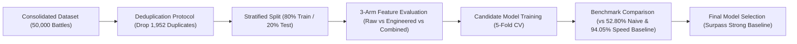

<div align="center">


## UNIVERSITY OF CARABOBO
### FACULTY OF EXPERIMENTAL SCIENCES AND TECHNOLOGY (FACYT)
#### DEPARTMENT OF COMPUTER SCIENCE

**Course:** Machine Learning (*Machine Learning - Elective 2026*)  
**Professor:** Álvaro Espinoza  

---

# Pokémon Battle Winner Predictor
### Assignment 1: Exploratory Data Analysis (EDA) & Feature Engineering

[](https://www.python.org/)
[](https://jupyter.org/)
[](LICENSE)
[](#)

</div>

---

## 📖 1. Project Overview & Problem Formulation

In competitive turn-based games such as Pokémon, match outcomes are determined by a complex interplay of deterministic physical stats (HP, Attack, Defense, Special Attack, Special Defense, Speed), elemental type effectiveness multipliers ($2\times, 0.5\times, 0\times, 1\times$), and special evolutionary tier statuses (Mega Evolutions, Primal Reversions, and Alternative Battle Formes).

The primary objective of this project is to build an end-to-end Machine Learning pipeline to **predict the winning Pokémon in an unobserved battle**.

- **Unit of Observation:** A single historical combat between two Pokémon defined by `First_pokemon` (position 1 contender) and `Second_pokemon` (position 2 contender).
- **Target Variable Formulation:** Binary classification target:
  $$\text{Target\_First\_Wins} = \begin{cases} 1, & \text{if } \text{Winner} = \text{First\_pokemon} \\ 0, & \text{if } \text{Winner} = \text{Second\_pokemon} \end{cases}$$

---

## 📁 2. Repository Structure

```text
pokemon_battle_winner_predictor/
│
├── data/                                 # Primary dataset directory
│   ├── pokemon.csv                       # 800 Pokémon with 12 attributes (Stats, Types, Generation, Legendary)
│   ├── combats.csv                       # 50,000 historical combat records with Winner ID
│   ├── tests.csv                         # 10,000 unlabelled test battles for prediction
│   └── pokemon_combats_unified.csv       # Unified analytical table: 50,000 battles × 29 cols (derived, tracked)
│
├── scripts/                              # Data / feature-engineering pipeline
│   ├── merge.py                          # Builds the unified table with schema assertions (see §3.3)
│   └── features.py                       # Modular feature engineering functions (§5)
│
├── notebooks/                            # Executable Jupyter Notebooks
│   └── 01_eda_pokemon.ipynb              # Official English Assignment 1 Notebook (100% Pre-Executed)
│
├── logo/                                 # Institutional assets
│   └── Logo_Facyt.svg.png                # FACYT University Logo
│
├── requirements.txt                      # Reproducible dependencies file
├── .gitignore                            # Excludes local files and drafts
└── README.md                             # Project documentation and executive summary
```

---

## ⚡ 3. Quickstart & Environment Setup

### 3.1 Clone Repository and Install Dependencies
```powershell
# Clone the repository
git clone https://github.com/errodd/pokemon_battle_winner_predictor.git
cd pokemon_battle_winner_predictor

# Install dependencies
pip install -r requirements.txt
```

### 3.2 Launch Jupyter Notebook
```powershell
# Launch the pre-executed English analysis notebook
py -m notebook notebooks/01_eda_pokemon.ipynb
```

> [!NOTE]
> All code cells in `notebooks/01_eda_pokemon.ipynb` are **100% pre-executed** with non-null execution counts and embedded outputs, charts, and tables for immediate evaluation.

### 3.3 Reproduce the Unified Dataset (Feature-Engineering Pipeline)

The EDA reads from a **single consolidated table**, `data/pokemon_combats_unified.csv`, generated by `scripts/merge.py` from the raw CSV files:

- Each row is one historical battle, with the stats of both fighters merged twice using `_first` / `_second` suffixes.
- Missing name in species `#63` (`Primeape`) is audited and imputed prior to relational joins.
- Rigorous schema assertions and invariants validate primary keys, referential integrity, null constraints, and target domain $\{0, 1\}$.
- The binary target `Target_First_Wins` is derived (`1` = `First_pokemon` wins).
- Engineered differential features are added via `scripts/features.py`: `Speed_diff`, `Attack_diff`, and `Defense_diff`.

```powershell
# The script can be executed from the repository root or from data/
python scripts/merge.py
```

> [!NOTE]
> The unified CSV is **tracked** in the repository, so it does not need to be regenerated to run the notebook. It should be re-generated and committed whenever the feature definitions in `merge.py` change.

---

## 🔬 4. Key Exploratory Findings & Empirical Insights

Across the 11 analytical sections of the EDA, key mechanics governing combat outcomes were identified:

1. **Speed as a Decisive Axis ($r = +0.678$):**  
   - Among the numerical differential features explored, Speed differential ($\Delta\text{Speed} = \text{Speed}_1 - \text{Speed}_2$) shows the strongest univariate linear association with victory.
   - Being faster than the rival yields a **$92.39\%$ victory rate**, whereas being slower collapses victory to **$4.60\%$**.
2. **Outcome Determinism and Second-Turn Rule in Speed Ties:**  
   - **$94.0\%$ ($1,712$ pairs)** of re-matched combats are completely deterministic (invariant to positioning order).
   - In exact speed tie scenarios ($\text{Speed}_1 == \text{Speed}_2$), the simulator awards the victory to `Second_pokemon` in **$100\%$ of the $1,328$ observed cases** (2.66% of all battles).
3. **Special Forms Taxonomy & Confounding Hypothesis:**  
   - **Primal Reversions ($83.3\%$)**, **Mega Evolutions ($73.6\%$)**, **Alternative Battle Formes ($70.6\%$)**, and **Standard Legendaries ($68.5\%$)** significantly overpower standard Pokémon, which we hypothesize is primarily mediated by their base-stat advantage ($+100$ to $+350$ points). We explicitly treat this as a hypothesis, as category status and stat totals are naturally confounded and will be controlled during multivariate modeling.
4. **Elemental Matchup Impact:**  
   - Holding an elemental type advantage delivers a **$+10.7\%$ net win rate increase** ($52.77\%$ vs $42.05\%$), acting as the vital tie-breaker in speed-parity battles.
5. **Class Balance & Strong Baselines:**  
   - Target distribution: **Class 0 ($52.80\%$)** vs **Class 1 ($47.20\%$)**.
   - **Naive Majority Class Baseline is established at $52.80\%$**.
   - **Strong Speed-Based Baseline is established at $94.05\%$** (faster fighter wins; second wins on exact speed ties). This constitutes the strong domain benchmark to surpass in Assignment 2, not an empirical ceiling.
6. **Duplicate Handling & Data Leakage Prevention:**  
   - The dataset contains **1,952 exact duplicate battles** (3.9%), which we hypothesize are repeated simulator executions. To prevent cross-fold data leakage, all exact duplicates will be removed prior to the train/test split.

---

## 🛠️ 5. Master Engineered Features (Section 10)

Five domain-grounded mathematical features were engineered in `scripts/features.py` to capture combat mechanics:

| Feature Name | Mathematical Definition | Domain Interpretation & Predictive Impact |
| :--- | :---: | :--- |
| **`Speed_diff`** | $\text{Speed}_1 - \text{Speed}_2$ | Turn-order initiative ($r = +0.678$). |
| **`Stat_Total_Diff`** | $\text{Total\\_Stats}_1 - \text{Total\\_Stats}_2$ | Total combat power gap ($r = +0.470$). |
| **`Atk_Def_Penetration_Diff`** | $\frac{\text{Attack}_1}{\text{Defense}_2} - \frac{\text{Attack}_2}{\text{Defense}_1}$ | Physical damage penetration ($r = +0.242$). |
| **`Special_Form_Advantage`** | $\text{Is\\_Special}_1 - \text{Is\\_Special}_2$ | Evolutionary tier advantage ($75.9\%$ vs $18.9\%$ win rate). |
| **`Type_Advantage_Ratio`** | $\log_2\left(\frac{\text{Eff}_{1 \rightarrow 2} + 0.1}{\text{Eff}_{2 \rightarrow 1} + 0.1}\right)$ | Symmetric elemental weakness exploitation ($+10.7\%$ win rate boost). |

---

## 🗺️ 6. Modeling Roadmap (Assignment 2)


```mermaid
graph LR
    A["Consolidated Dataset (50,000 Battles)"] --> B["Deduplication Protocol (Drop 1,952 Duplicates)"]
    B --> C["Stratified Split (80% Train / 20% Test)"]
    C --> D["3-Arm Feature Evaluation (Raw vs Engineered vs Combined)"]
    D --> E["Candidate Model Training (5-Fold CV)"]
    E --> F["Benchmark Comparison (vs 52.80% Naive & 94.05% Speed Baseline)"]
    F --> G["Final Model Selection (Surpass Strong Baseline)"]
```

### 6.1 Evaluation Scenarios for "Unseen Combats"
- **Scenario A (New Matchup Between Known Pokémon):** Both combatants have been observed in other battles during training, but this specific head-to-head matchup is novel. Evaluated via standard stratified 80/20 train/test split (primary Assignment 2 objective).
- **Scenario B (Generalization to Completely Unseen Pokémon):** At least one combatant has never appeared in any training battle. Evaluated via `GroupShuffleSplit` (grouped by Pokémon ID) to test zero-shot generalization.
- **Scenario C (Repeated Execution of an Observed Matchup):** Re-evaluating identical pairings. Requires strict duplicate isolation across folds.

### 6.2 3-Arm Comparative Modeling Strategy
Rather than prematurely assuming that the 5 master engineered features completely replace the raw attributes, Assignment 2 will benchmark three competing representations under identical 5-fold cross-validation folds:
- **Model A (Raw Base Stats):** 12 raw base stats ($6 \times 2$) for both contenders.
- **Model B (Master Engineered Features):** 5 domain-engineered relative features (`Speed_diff`, `Stat_Total_Diff`, `Atk_Def_Penetration_Diff`, `Special_Form_Advantage`, `Type_Advantage_Ratio`).
- **Model C (Combined Raw + Engineered):** 17 features, evaluating whether non-linear models benefit from both raw scale and differential relative signals.

### 6.3 Candidate Models & Success Criteria
- **Candidate Models:** Logistic Regression, Decision Trees (CART), Random Forest Classifier, Gradient Boosting / XGBoost, KNN, and Multi-Layer Perceptron (MLP).
- **Primary Metrics:** Accuracy, Macro F1-Score, Confusion Matrix, and ROC-AUC.
- **Target Metric:** Consistently surpass the **$94.05\%$ Strong Speed-Based Baseline** on unseen test battles, demonstrating that the classifier successfully resolves the ~6% parity/conflict zone.

---

## 📜 7. Authors & Academic Affiliation

- **Authors:** Anthony Quero and Luigi Quero
- **Institution:** University of Carabobo (UC) — Experimental Faculty of Science and Technology (FACYT)
- **Department:** Department of Computer Science
- **Subject:** Machine Learning (2026)
