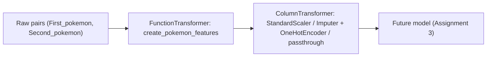

<div align="center">


## UNIVERSITY OF CARABOBO
### FACULTY OF EXPERIMENTAL SCIENCES AND TECHNOLOGY (FACYT)
#### DEPARTMENT OF COMPUTER SCIENCE

**Course:** Machine Learning (*Machine Learning - Elective 2026*)  
**Professor:** Álvaro Espinoza  

---

# Pokémon Battle Winner Predictor
### Assignment 1: Exploratory Data Analysis (EDA) · Assignment 2: Data Preparation & Feature Engineering

[](https://www.python.org/)
[](https://jupyter.org/)
[](LICENSE)
[](#)

</div>

---

## 📖 1. Project Overview & Problem Formulation

In competitive turn-based games such as Pokémon, match outcomes are determined by a complex interplay of deterministic physical stats (HP, Attack, Defense, Special Attack, Special Defense, Speed), elemental type effectiveness multipliers ($2\times, 0.5\times, 0\times, 1\times$), and special evolutionary tier statuses (Mega Evolutions, Primal Reversions, and Alternative Battle Formes).

The primary objective of this project is to build an end-to-end Machine Learning pipeline to **predict the winning Pokémon in an unobserved battle**.

- **Unit of Observation:** A single historical combat between two Pokémon defined by `First_pokemon` (position 1 contender) and `Second_pokemon` (position 2 contender).
- **Target Variable Formulation:** Binary classification target:
  $$\text{Target\_First\_Wins} = \begin{cases} 1, & \text{if } \text{Winner} = \text{First\_pokemon} \\ 0, & \text{if } \text{Winner} = \text{Second\_pokemon} \end{cases}$$

---

## 📁 2. Repository Structure

```text
pokemon_battle_winner_predictor/
│
├── data/                                 # Primary dataset directory
│   ├── pokemon.csv                       # 800 Pokémon with 12 attributes (Stats, Types, Generation, Legendary)
│   ├── combats.csv                       # 50,000 historical combat records with Winner ID
│   ├── tests.csv                         # 10,000 unlabelled test battles for prediction
│   └── pokemon_combats_unified.csv       # Unified analytical table: 50,000 battles × 29 cols (derived, tracked)
│
├── scripts/                              # Data / feature-engineering pipeline
│   ├── merge.py                          # Builds the unified table with schema assertions (see §3.3)
│   └── features.py                       # Modular feature engineering functions (§5)
│
├── notebooks/                            # Executable Jupyter Notebooks
│   ├── 01_eda_pokemon.ipynb              # Assignment 1: EDA (100% Pre-Executed)
│   └── 02_data_preparation.ipynb         # Assignment 2: Data Preparation & Feature Engineering (100% Pre-Executed)
│
├── logo/                                 # Institutional assets
│   └── Logo_Facyt.svg.png                # FACYT University Logo
│
├── requirements.txt                      # Reproducible dependencies file
├── .gitignore                            # Excludes local files and drafts
└── README.md                             # Project documentation and executive summary
```

---

## ⚡ 3. Quickstart & Environment Setup

### 3.1 Clone Repository and Install Dependencies
```powershell
# Clone the repository
git clone https://github.com/errodd/pokemon_battle_winner_predictor.git
cd pokemon_battle_winner_predictor

# Install dependencies
pip install -r requirements.txt
```

### 3.2 Launch Jupyter Notebook
```powershell
# Assignment 1: EDA notebook
py -m notebook notebooks/01_eda_pokemon.ipynb

# Assignment 2: Data preparation notebook
py -m notebook notebooks/02_data_preparation.ipynb
```

> [!NOTE]
> Both notebooks are **100% pre-executed** with embedded outputs, charts, and tables for immediate evaluation. `02_data_preparation.ipynb` runs end-to-end from a restarted kernel, reads only the raw CSV files in `data/`, and imports the domain helpers (`TYPE_CHART`, `classify_form`, `calculate_type_multiplier`) from `scripts/features.py`. It writes no files.

### 3.3 Reproduce the Unified Dataset (Feature-Engineering Pipeline)

The EDA reads from a **single consolidated table**, `data/pokemon_combats_unified.csv`, generated by `scripts/merge.py` from the raw CSV files:

- Each row is one historical battle, with the stats of both fighters merged twice using `_first` / `_second` suffixes.
- Missing name in species `#63` (`Primeape`) is audited and imputed prior to relational joins.
- Rigorous schema assertions and invariants validate primary keys, referential integrity, null constraints, and target domain $\{0, 1\}$.
- The binary target `Target_First_Wins` is derived (`1` = `First_pokemon` wins).
- Engineered differential features are added via `scripts/features.py`: `Speed_diff`, `Attack_diff`, and `Defense_diff`.

```powershell
# The script can be executed from the repository root or from data/
python scripts/merge.py
```

> [!NOTE]
> The unified CSV is **tracked** in the repository, so it does not need to be regenerated to run the notebook. It should be re-generated and committed whenever the feature definitions in `merge.py` change.

---

## 🔬 4. Key Exploratory Findings & Empirical Insights

Across the 11 analytical sections of the EDA, key mechanics governing combat outcomes were identified:

1. **Speed as a Decisive Axis ($r = +0.678$):**  
   - Among the numerical differential features explored, Speed differential ($\Delta\text{Speed} = \text{Speed}_1 - \text{Speed}_2$) shows the strongest univariate linear association with victory.
   - Being faster than the rival yields a **$92.39\%$ victory rate**, whereas being slower collapses victory to **$4.60\%$**.
2. **Outcome Determinism and Second-Turn Rule in Speed Ties:**  
   - **$94.0\%$ ($1,712$ pairs)** of re-matched combats are completely deterministic (invariant to positioning order).
   - In exact speed tie scenarios ($\text{Speed}_1 == \text{Speed}_2$), the simulator awards the victory to `Second_pokemon` in **$100\%$ of the $1,328$ observed cases** (2.66% of all battles).
3. **Special Forms Taxonomy & Confounding Hypothesis:**  
   - **Primal Reversions ($83.3\%$)**, **Alternative Battle Formes ($78.3\%$)**, **Standard Legendaries ($76.4\%$)**, and **Mega Evolutions ($73.6\%$)** significantly overpower standard Pokémon, which we hypothesize is primarily mediated by their base-stat advantage ($+100$ to $+350$ points). We explicitly treat this as a hypothesis, as category status and stat totals are naturally confounded and will be controlled during multivariate modeling.
4. **Elemental Matchup Impact:**  
   - Holding an elemental type advantage delivers a **$+10.7\%$ net win rate increase** ($52.77\%$ vs $42.05\%$), acting as the vital tie-breaker in speed-parity battles.
5. **Class Balance & Strong Baselines:**  
   - Target distribution: **Class 0 ($52.80\%$)** vs **Class 1 ($47.20\%$)**.
   - **Naive Majority Class Baseline is established at $52.80\%$**.
   - **Strong Speed-Based Baseline is established at $94.05\%$** (faster fighter wins; second wins on exact speed ties). This constitutes the strong domain benchmark to surpass in Assignment 2, not an empirical ceiling.
6. **Duplicate Handling & Data Leakage Prevention:**  
   - The dataset contains **1,952 exact duplicate battles** (3.9%), which we hypothesize are repeated simulator executions. In Assignment 2 they are **kept** and leakage is prevented by splitting by unordered pair instead (see §6).

---

## 🛠️ 5. Master Engineered Features (Section 10)

Five domain-grounded mathematical features were engineered in `scripts/features.py` to capture combat mechanics:

| Feature Name | Mathematical Definition | Domain Interpretation & Predictive Impact |
| :--- | :---: | :--- |
| **`Speed_diff`** | $\text{Speed}_1 - \text{Speed}_2$ | Turn-order initiative ($r = +0.678$). |
| **`Stat_Total_Diff`** | $\text{Total\\_Stats}_1 - \text{Total\\_Stats}_2$ | Total combat power gap ($r = +0.470$). |
| **`Atk_Def_Penetration_Diff`** | $\frac{\text{Attack}_1}{\text{Defense}_2} - \frac{\text{Attack}_2}{\text{Defense}_1}$ | Physical damage penetration ($r = +0.242$). |
| **`Special_Form_Advantage`** | $\text{Is\\_Special}_1 - \text{Is\\_Special}_2$ | Evolutionary tier advantage ($75.9\%$ vs $18.9\%$ win rate). |
| **`Type_Advantage_Ratio`** | $\log_2\left(\frac{\text{Eff}_{1 \rightarrow 2} + 0.1}{\text{Eff}_{2 \rightarrow 1} + 0.1}\right)$ | Symmetric elemental weakness exploitation ($+10.7\%$ win rate boost). |

---

## 🧪 6. Assignment 2: Data Preparation & Feature Engineering

Notebook: [`notebooks/02_data_preparation.ipynb`](notebooks/02_data_preparation.ipynb). It turns the EDA findings into a reproducible, leakage-safe preparation pipeline. It does **not** train, compare, or tune models.

### 6.1 EDA → Preparation Decisions (summary)

| EDA Finding | Decision |
| :--- | :--- |
| `Winner` is the outcome | Derive `Target_First_Wins` and drop `Winner` immediately |
| 784 distinct fighter IDs | IDs excluded from features; used only as split groups |
| 1,822 pairs appear in both orientations; 1,952 exact duplicates | Train/test split grouped by **unordered pair** `(min(id), max(id))`; duplicates kept |
| `Type 2` missing in ~48% of species (monotype) | Impute constant `"None"` (a real game state, not missing data) |
| Species `#63` has no name | Deterministic imputation `Primeape` (exact stat match) |
| `Generation` uncorrelated with target | Excluded (confirmed on train only) |
| Heterogeneous stat scales | `StandardScaler` inside the pipeline |

The full table with evidence and justification is in §3 of the notebook.

### 6.2 Split Strategy

- `GroupShuffleSplit(test_size=0.20, random_state=42)` grouped by unordered pair: **40,078 train / 9,922 test**, 0 shared pairs, class balance preserved (52.8% / 47.2%).
- A random row split would leak ~11.8% of test matchups into train. Grouping keeps every repetition and orientation of a matchup on the same side (*Scenario A*: new matchup between known Pokémon).
- The EDA used all 50,000 combats, so the test partition indirectly influenced feature selection; from this notebook on, no decision uses test data.

### 6.3 Pipeline


```mermaid
graph LR
    A["Raw pairs (First_pokemon, Second_pokemon)"] --> B["FunctionTransformer: create_pokemon_features"]
    B --> C["ColumnTransformer: StandardScaler / Imputer + OneHotEncoder / passthrough"]
    C --> D["Future model (Assignment 3)"]
```

| Group | Columns | Transformation |
| :--- | :--- | :--- |
| Numeric (raw) | 12 base stats (`*_first`, `*_second`) | `StandardScaler` |
| Numeric (engineered) | `Speed_diff`, `Stat_Total_Diff`, `Atk_Def_Penetration_Diff`, `Type_Advantage_Ratio` | `StandardScaler` |
| Ordinal | `Special_Form_Advantage` ∈ {-1, 0, 1} | passthrough |
| Nominal (`full` arm only) | `Type 1/2` of both fighters | `SimpleImputer("None")` + `OneHotEncoder(min_frequency=0.01)` |
| Binary (`full` arm only) | `Legendary_first`, `Legendary_second` | passthrough |
| Excluded | `Winner`, IDs, `Name_*`, `Generation_*` | dropped (`remainder="drop"`) |

Representation arms defined for later comparison: **A_raw** (12), **B_engineered** (5), **C_combined** (17, default), **full** (89).

### 6.4 Verifications (train only)

Row count preserved, no NaN/infinite values, no excluded column in the output, input not modified, output feature names inspected, and the same fitted pipeline transforms `data/tests.csv` without errors.

---

## 🗺️ 7. Modeling Roadmap (Assignment 3)

- **Cross-validation:** `GroupKFold` / `StratifiedGroupKFold` on the same unordered-pair groups, inside the training partition only. The holdout partition is used once, for the final evaluation.
- **Comparisons:** arms A vs B vs C vs `full`; whether `Special_Form_Advantage` adds signal beyond `Stat_Total_Diff`; whether one-hot types add signal beyond `Type_Advantage_Ratio`.
- **Candidate models:** Logistic Regression (regularized, because Arm C has exact linear redundancies), Decision Trees, Random Forest, Gradient Boosting, KNN, MLP.
- **Benchmarks to surpass:** Naive Majority Baseline **52.80%** and Strong Speed-Based Baseline **94.05%**.
- **Metrics:** Accuracy, Macro F1-Score, Confusion Matrix, ROC-AUC.
- **Out of scope so far:** generalization to completely unseen Pokémon (*Scenario B*, `GroupShuffleSplit` by Pokémon ID).

---

## 📜 8. Authors & Academic Affiliation

- **Authors:** Anthony Quero and Luigi Quero
- **Institution:** University of Carabobo (UC) — Experimental Faculty of Science and Technology (FACYT)
- **Department:** Department of Computer Science
- **Subject:** Machine Learning (2026)
